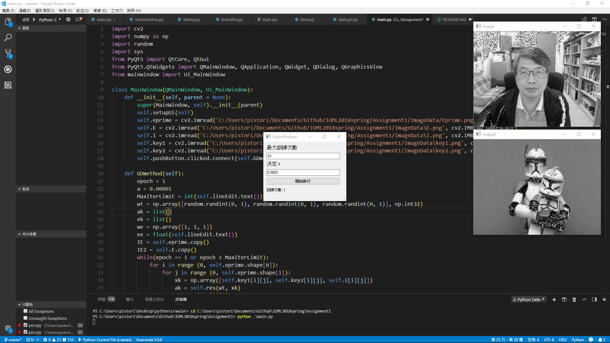

# Assignment1
### running result

### Built With
  * numpy
  * pyQt
  * opencv
 
### Report and Discussion
about the code :
* main:
  * 呼叫視窗建立

* class MainWindow:
  * 建立視窗，讀進圖片初始化物件

* GDmethod:
  * 根據給定的演算法進行向量w的計算與修正，w的初始值給定為3個隨機的0~1的數字組成的向量，α根據建議給定為0.000001，ε的運算標準為w(k+1) / w(k)
  * 以雙層的for迴圈進行整個圖片的遍歷，此稱作訓練次數一次
  * 若ε的成長率並沒有超過使用者給定的數字(在1 + ε(給定)與 1 - ε(給定)之間，)，代表w已經趨近平穩，那麼會跳出while迴圈

* res:
  * 實現向量內積

### result discussion
image 是根據 Eprime 解出來的結果，image2 是根據 E 解出來的結果。
根據結果的圖片來看，圖像已經大致接近還原，但是有一些像素丟失，丟失的像素顯示為白色或黑色，個人猜測可能是原始像素修正後越界，
超過了圖片的表示範圍(0~255)，所以將其顯示成255(白色)或0(黑色)，可以顯示我找到的w並非最佳解，或許這只是一個區域最佳解，
若要找到全域最佳解，可能要改變隨機產生初始w的範圍，若w落在正確的地方才能找到全域最佳解，但既然區域最佳解已找到，那便符合GD method的精神。

在實行演算法的時候我遇到比較大的困難是要使用array來表示vector進行運算的時候，偶爾有些轉不過來的情況，不過還好這些在網路上還算有些資源可以輕易的找到
另外就是這個程式會在訓練次數一次的時候就得到區域最佳解(平穩)，個人在訓練次數第二次時也有觀察迴圈裡的變數變化情形，也是跟第一次有差異的，
然而第二次得到的w卻會跟第一次得到的w幾乎相同，雖然觀察圖像還原度代表跟變數變化之後想想我應該是沒有環節出錯，稍微有點懷疑，但目前沒有得到其他結論。

### What I learn
1. Single-Layer Neural Network building by Gradient Descent Method
2. 圖片加密、解密的算法
