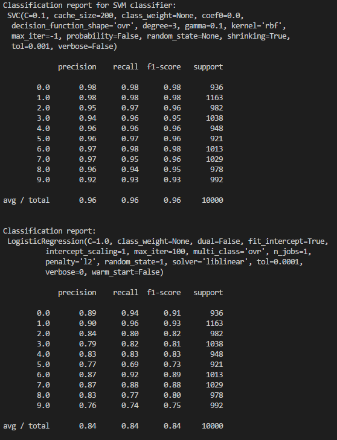
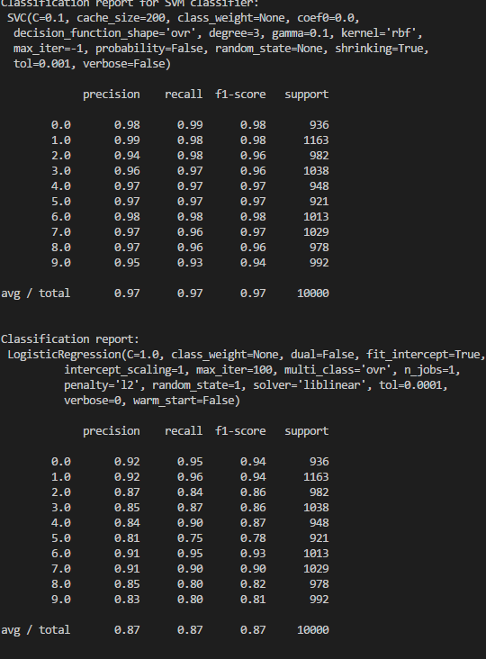
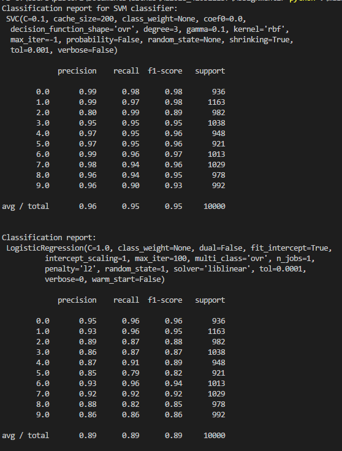
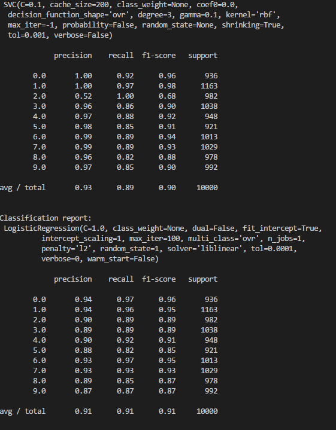

# Assignment2
### Running Result
    

### Report and Discussion
首先先將數據集讀入

    mnist = fetch_mldata('MNIST original')
    #拆成訓練跟測試用
    train_x, test_x, train_y, test_y = train_test_split( mnist.data, mnist.target,test_size=1 / 7.0, random_state = 0)

這裡用6萬筆訓練，1萬筆測試

根據建議的方式正規化

    #標準化
    train_x = train_x / 255
    test_x = test_x / 255

查看一下該下降的維度包含的特徵

    pca = PCA()
    pca.fit(train_x)
    for i in np.arange(0.5, 1.0, 0.05):
        n = find_d(pca.explained_variance_ratio_, i)
        print(i,n)

其結果為

    0.5 11
    0.55 14
    0.60 17
    0.650 21
    0.70 26
    0.75 33
    0.80 43
    0.85 59
    0.90 87
    0.95 154

可以看見該資料集在154的維度可以顯示95%的特徵，因為154維在6萬筆資料中將會執行好一段時間，所以這裡就先用16維稍微試試看

    pca = PCA(n_components = 16)
    train_x_reduced = pca.fit_transform(train_x)
    test_x_reduced = pca.transform(test_x)

維度下降完畢後開始使用辨識器看結果如何

    clf = svm.SVC(C = 0.1, kernel='rbf', gamma = 0.1)
    clf = clf.fit(train_x_reduced, train_y)
    predict = clf.predict(test_x_reduced)
    print("Classification report for SVM classifier: \n %s\n\n%s\n"
      % (clf, metrics.classification_report(test_y, predict)))

    clf2 = LogisticRegression(random_state= 1)
    clf2 = clf2.fit(train_x_reduced, train_y)
    predict = clf2.predict(test_x_reduced)
    print("Classification report: \n %s\n\n%s\n"
      % (clf2, metrics.classification_report(test_y, predict)))
    
這裡使用SVM與LR辨識

結果是出人意料的好，由其SVM到達96%的準確率，LR因其線性關係稍弱，不過也算得到不錯的成績

將維度調到25試試看

結果準確率有上升

將維度調到49

準確率居然下降

調到87的話

下降的更加明顯

### Result Discussion

也就是說，SVM在維度25上下就足夠，超過的話會有overfit的可能性，所以雖然理想的維度是154，但仍要考慮模型的特性來做下降，不過值得一提的是隨著維度上升LR的準確率也上升，也就是說隨著維度的上升這個數據集更能以線性的方式表達，但看似更能對應更多狀況的SVM卻下降。然而維度這種東西是越小越好，也就是說SVM以較小的維度表現出較高的準確率確實仍是相對好的選擇。

不過在這個例子中我們同時也能知道沒有甚麼東西是絕對的，可以影響到模型預測的因素很多，並沒有絕對的解答，而是需要一定程度的try and error，才有可能找到相對的最佳解

做這次的作業途中實在是有相當多的東西需要試試，不過我想我已經掌握了降維跟訓練模型的基本流程，應該可以為期末的專案做好更完善的準備。另外目前對於機器學習的感想就是前置處理非常多，而且通常處理完那些 code 就不一定會再用到，感覺是比較雜亂，而且實際上會運作的 code 好像也不多，然後就是我前期一直想做圖片表達降維後的數據，不過現在感覺沒什麼意義了，覺得蹉跎掉很多時光，這大概就是我花最多時間胡亂闖的地方吧，感覺有點複雜。

### What I learn

維度下降法

基礎的模型預測跟擬合
