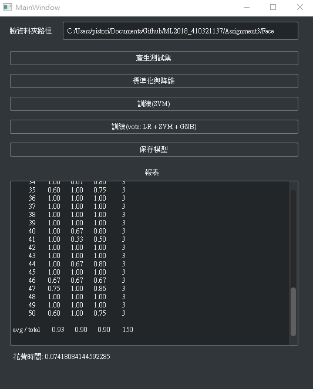
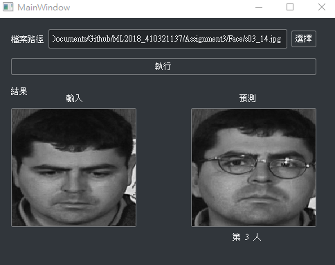

# Assignment3
### Running Result

 

### Report and Discussion
在 train.py 中

首先讓使用者讀入測試資料，產生測試集，並在這裡縮小一下圖片的大小

        img = imread(path + '/' + f , mode='L')
        img = imresize(img, (30, 40))

然後根據訓練的需求，產生由圖片跟標籤(正確答案)產生的array，train_x, train_y, test_x, test_y

為了方便之後調用，利用pickle的功能將array保存，就不用再次讀取並跑回圈

    f = open('train_x.pickle', 'wb')
        pickle.dump(train_x, f)
        f.close()

讀取完測試集資料後就開始標準化

    #標準化
        scaler = StandardScaler()
        self.train_x_stand = scaler.fit_transform(self.train_x)
        self.test_x_stand = scaler.fit_transform(self.test_x)

然後用PCA的方法降低維度

    pca = PCA(0.95)
        self.train_x_reduced = pca.fit_transform(self.train_x_stand)
        self.test_x_reduced = pca.transform(self.test_x_stand)
        self.save_reduce(self.train_x_reduced, self.test_x_reduced)

保留95%的方差百分比

最後找辨識器開始訓練，這裡使用三種，分別是LogisticRegression、SVM、GaussianNB，並且有結合三種辨識器的VotingClassifier

    clf1 = LogisticRegression(random_state=1)
    clf2 = SVC(C = 100, gamma = 0.0001, probability = True)
    clf3 = GaussianNB()
    eclf = VotingClassifier(estimators = [('lr', clf1), ('svm', clf2), ('gnb', clf3)], weights= [1.5, 3, 1.5], voting = 'hard')

在調整SVM參數的時候使用了sklearn的GridSearchCV進行了自動調整

    param_grid = {'C': [1, 10, 1e2, 1e3, 5e3, 1e4, 5e4, 1e5],
                'gamma': [0.0001, 0.0005, 0.001, 0.005, 0.01, 0.1, 1], }
    clf = GridSearchCV(SVC(kernel='rbf', class_weight='balanced'), param_grid)
    clf = clf.fit(train_x_reduced, train_y)
    print(clf.best_estimator_)

以下是各個辨識器對test data做辨識的時候得到的準確率

 * LogisticRegression : 0.85
 * SVM : 0.93
 * GaussianNB : 0.78
 * VotingClassifier : 0.91

可以發現線性辨識器在這個資料集中居然有相當不錯的成績，而SVM此種經典算法在這裡取得最好的成績，GaussianNB在這裡較差強人意一些，我是聽說該方法對不算大量的資料集會相當有用才使用的，從結果來看可能並不適合這種問題?
總之看過個別表現後可以確定在嘗試結合辨識器的時候，應該讓SVM的權重大一些

然而結合後的辨識器經過一些權重的調整後，仍然無法突破SVM的準確率，於是在這裡決定不使用結合的辨識器，只使用SVM可能會帶來更好的辨識結果

決定了辨識器並且訓練過後，將結果的模型做保存

    pipe2 = Pipeline([('sc', StandardScaler()),
                    ('pca', PCA(n_components=100)),
                    ('clf', SVC(C = 100, gamma = 0.0001))
                    ])
    pipe2.fit(self.train_x, self.train_y)

    f = open('pipe1.pickle', 'wb')
    pickle.dump(pipe1, f)
    f.close()

在 main.py 中

首先讓使用者輸入照片，照片從檔案中打開

    path = QFileDialog.getOpenFileName()

之後將先前訓練好的模型讀入

    pipe = open('pipe2.pickle', 'rb')
    pipe = pickle.load(pipe)

讓模型做出預測

    predicted = pipe.predict(test)

### Result Discussion

### What I learn
